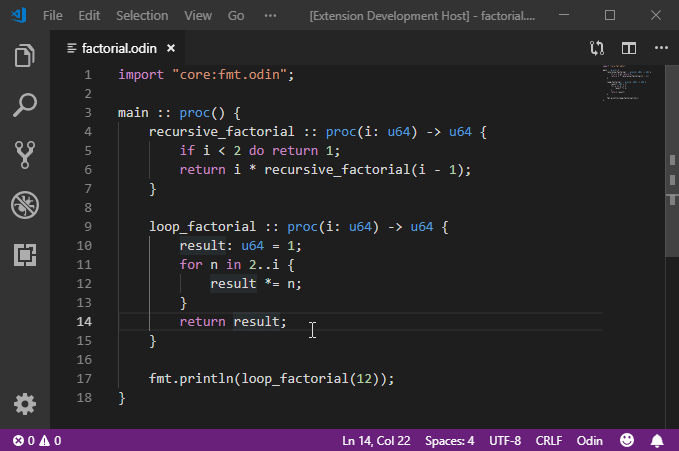

# Odin
Visual Studio Code syntax highlighting and code snippets for Odin.

# Screenshots

# Features
- [X] Syntax highlighting
- [X] Snippets
- [X] Bracket matching
- [X] Bracket autoclosing
- [X] Bracket autosurrounding
- [X] Comment toggling
- [X] Auto-indentation
- [X] Code folding
- [ ] Intellisense

# Installing Without The Extensions Marketplace
To start using the extension, copy it into the `<user home>/.vscode/extensions` folder and restart Code. Obviously this step is not intended for those installing from the built-in Extensions marketplace.

# Contributing
There may be highlighting issues. Please make [issues](https://github.com/asmoaesl/odin-vscode/issues) to see these be solved.
