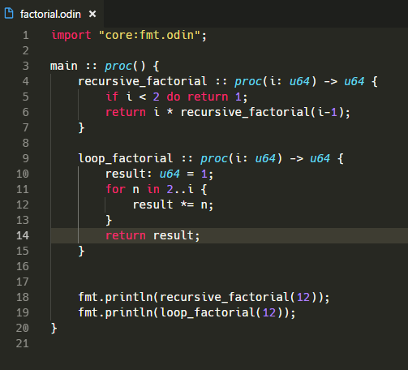

# Odin
Syntax highlighting and code snippets for Visual Studio Code.

### 1.0.0

- Ported https://github.com/odin-lang/sublime-odin/blob/master/Odin.sublime-syntax to .tmLanguage (this).

### 1.1.0

- Added support for code snippets.
- Added one code snippet: `main`

### 1.1.1

- Replaced Unlicense with MIT license.

I'm not too creative right now, so **if you want to see any more snippets, as always, please make an issue or pull request.** Thanks.

# Installing Without The Extensions Marketplace
To start using the extension, copy it into the `<user home>/.vscode/extensions` folder and restart Code. Obviously this step is not intended for those installing from the built-in Extensions marketplace.

# Contributing
This plugin is very new, and so there may be highlighting issues or missing code snippets. Please make [issues](https://github.com/asmoaesl/odin-vscode/issues) or pull requests to see these be solved.
